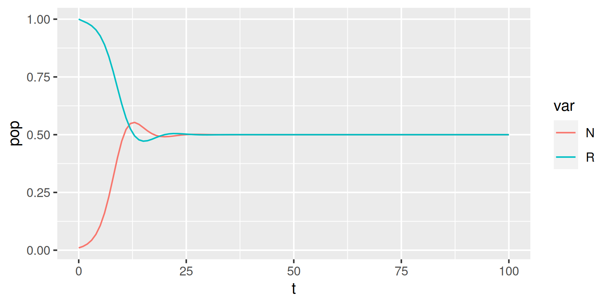

<!-- README.md is generated from README.Rmd. Please edit that file -->

# fluents 

<!-- badges: start -->

[](https://CRAN.R-project.org/package=fluents)
[](https://lifecycle.r-lib.org/articles/stages.html#experimental)
<!-- badges: end -->

The goal of `{fluents}` is to be an opinionated R package
re-implementation of [grind.R](https://tbb.bio.uu.nl/rdb/grindR.html) by
Rob de Boer, Theoretical Biology and Bioinformatics, University of
Utrecht. `grind.R` is a port from the same author C-based program [GRIND
(GReat INtegrator Differential
equations)](https://tbb.bio.uu.nl/rdb/grindC.html) to R.

`{fluents}` aims at packing the same functionality as `grind.R`,
departing from `grind.R` in a few ways:

- `{fluents}` is an R package, `grind.R` is a script.
- `{fluents}` is under public version control at GitHub, facilitating
  open collaboration and easy distribution.
- `{fluents}`’s API has more functions that do less each, while
  `grind.R`’s has fewer functions that do more each.

## Installation

You can install the current version of `{fluents}` with:

``` r
# install.packages("remotes")
remotes::install_github("ramiromagno/fluents")
```

## Example

``` r
library(fluents)
#> 
#> Attaching package: 'fluents'
#> The following object is masked from 'package:base':
#> 
#>     solve

# `m`: Lotka-Volterra model
m <- function(t, state, parms) {
  with(as.list(c(state, parms)), {
    dR <- r * R * (1 - R / K) - a * R * N
    dN <- c * a * R * N - delta * N
    
    return(list(c(dR, dN)))
  })
}

# `p`: vector of parameters
p <- c(
  r = 1,
  K = 1,
  a = 1,
  c = 1,
  delta = 0.5
)

# `s`: vector of initial state
s <- c(R = 1, N = 0.01)

# `t`: time points
t <- seq(0, 100, by= 1)

# Integrate the ODE
sol <- solve(s = s, p = p, m = m, t = t)

# Make a time plot of the solution `sol`
tidyr::pivot_longer(sol, cols = c("R", "N"), names_to = "var", values_to = "pop") %>%
ggplot(aes(x = t, y = pop, col = var)) +
  geom_line()
```



``` r

# Find steady states
steady_states(
  s0 = tidyr::expand_grid(R = seq(0, 1, 0.1), N = seq(0, 1, 0.1)),
  p = p,
  m = m
  )
#> diagonal element is zero 
#> [1] 2
#> diagonal element is zero 
#> [1] 2
#> # A tibble: 3 × 8
#>     ..R   ..N     R     N stability jacobian      eigenvalues eigenvectors 
#>   <dbl> <dbl> <dbl> <dbl> <chr>     <list>        <list>      <list>       
#> 1   0     0     0     0   unstable  <dbl [2 × 2]> <dbl [2]>   <dbl [2 × 2]>
#> 2   0.1   0.8   0.5   0.5 stable    <dbl [2 × 2]> <cpl [2]>   <cpl [2 × 2]>
#> 3   0.3   0.2   1     0   unstable  <dbl [2 × 2]> <dbl [2]>   <dbl [2 × 2]>
```

## From `grind.R` to `{fluents}`

| grind.R    | fluents           |
|------------|-------------------|
| `run()`    | `solve()`         |
| `newton()` | `steady_states()` |
